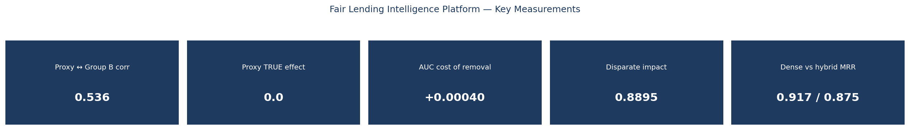
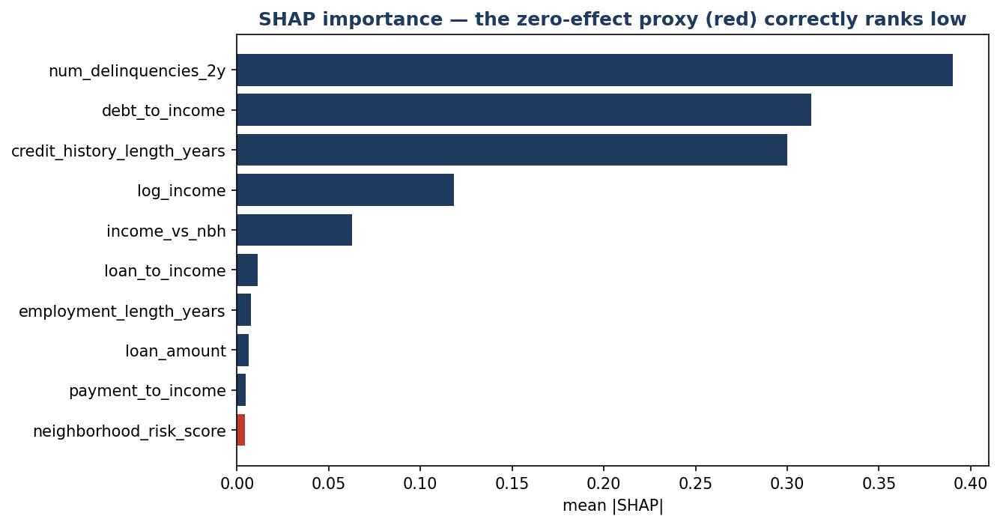
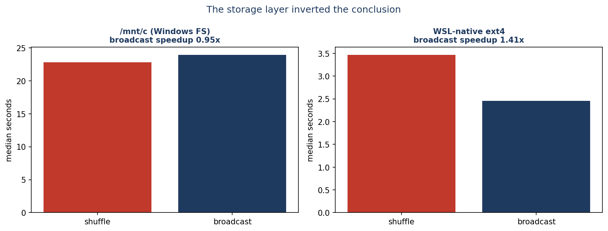
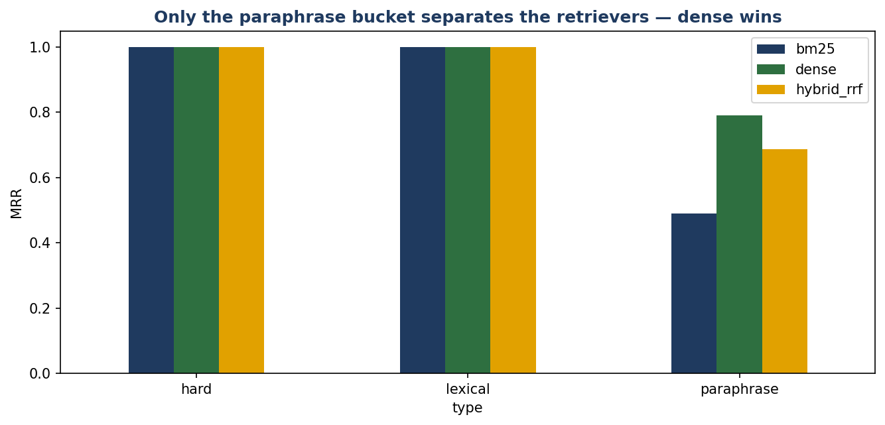

# Fair Lending Intelligence Platform

**A project I built to learn algorithmic fairness as a measurement problem:**
PySpark feature engineering at scale, credit risk modeling with SHAP explainability, a fair-lending
audit scored against injected ground truth, H3 geospatial redlining analysis, and a hybrid-retrieval
policy assistant with real red-teaming — unified around one lender, one dataset, one rulebook.

> Built by Nikhil Sinha. Every number below comes from a real executed run. Three of the headline
> findings **contradicted the hypothesis the project was designed around**, and they are reported as
> they came out rather than reframed. All data is synthetic; see Section 9 for methodology and
> honesty notes.

---

## 1. The Business Problem

A lender must do four hard things at once: process applications at scale, **explain** every decision
to the applicant it affects, **prove** it is not discriminating — including geographically — and
answer "what does our policy actually say?" without inventing an answer. Each of those is usually a
separate demo. Here they are one system: the policy corpus defines the thresholds the audit tests,
the audit scores the model the explainer explains, and the explainer feeds the notices the applicant
receives.

---

## 2. What I Was Trying to Get Right

- **The central hypothesis was refuted, with evidence.** A feature correlated **0.536** with the
  protected group and with **zero true causal effect** was expected to drive disparate impact.
  Removing it moved the disparate impact ratio 0.8895 → 0.8870 — negligible, and the wrong
  direction. Correlation with a protected class is *not* sufficient to produce measurable harm.
- **A benchmark that inverted when the storage layer changed.** On `/mnt/c`, broadcast join measured
  **0.95x** — i.e. "slower". On WSL-native ext4 the variance collapsed and the real **1.41x**
  appeared. Both runs are kept, the bad one labelled as a negative control.
- **A regulatory claim that was bootstrapped instead of asserted.** A thin-file result appeared to
  cross the four-fifths line (0.805 → 0.761); the 95% CIs overlap heavily on 2,746 rows, so it is
  reported as suggestive, not established.
- **Three guardrail mitigations attempted and all three rejected with measurements**, including one
  that would have refused 19 of 20 legitimate questions.
- **SHAP validated against the known data-generating process**, not just plotted — the zero-effect
  proxy correctly lands at rank 10 of 15.
- **Reproducibility verified by checksum at every stage**, after Project 10 shipped a fixed seed that
  turned out not to be reproducible.

---

## 3. Key Results (from real, executed runs)

| Area | Metric | Value |
|---|---|---|
| **Data** | Proxy ↔ Group B correlation / true causal effect | **0.536** / **0.0** |
| **Spark** | Feature table | 400,000 rows × 30 cols, 24 month partitions |
| **Spark** | Broadcast join speedup — `/mnt/c` vs ext4 | **0.95x** (noise) vs **1.41x** (clean) |
| **Spark** | Partition pruning speedup (ext4) | 1.23x |
| **Model** | Gradient boosting ROC AUC, with / without proxy | 0.7098 / 0.7094 |
| **Model** | AUC cost of removing the proxy | **+0.00040** (essentially free) |
| **SHAP** | Ground-truth validation checks passed | **3/3** |
| **SHAP** | Proxy rank among 15 features | **10th** (true effect 0.0) |
| **Fairness** | Disparate impact, with / without proxy | 0.8895 / 0.8870 (both pass 4/5) |
| **Fairness** | Equalized-odds TPR gap | 0.0744 |
| **Fairness** | Group-threshold mitigation | DI 1.0000, but approves **5,794** defaulters |
| **Geospatial** | corr(Group B share, approval) with / without proxy | −0.629 / −0.654 |
| **Geospatial** | corr(Group B share, average income) | **−0.822** |
| **RAG** | MRR — BM25 / dense / hybrid | 0.796 / **0.917** / 0.875 |
| **RAG** | Red team | **8/9**, one real fabrication found |
| **Adverse action** | Guardrail pass rate — LLM vs template | **10/18** vs **18/18** |

---

## 4. Dashboard Preview

Six tabs, all reading live pipeline output, including a working policy-assistant query box:

```bash
streamlit run dashboard/streamlit_app.py --server.port 8506 --server.fileWatcherType none
```

*(`--server.fileWatcherType none` is required: Streamlit's source watcher otherwise walks the entire
`transformers` package on every rerun, emitting hundreds of import errors and stalling the UI.)*

**Key measurements**


**SHAP validated against ground truth**


**The storage layer inverted the Spark conclusion**


**Retrieval by question type**


---

## 5. Real Evidence

### The hypothesis, refuted
```
                        disparate impact    ROC AUC
with geographic features        0.8895       0.7098
without                         0.8870       0.7094
```
SHAP ranks the zero-effect proxy 10th of 15. The model already had verified income — a strictly
better predictor of the same thing — so it learned to ignore a feature with no signal.

### The benchmark that inverted
```
/mnt/c   shuffle [37.294, 21.240, 22.800]  broadcast [23.919, 21.217, 24.250]  -> 0.95x
ext4     shuffle [4.216, 3.891, 3.465, 2.936, 2.943]
         broadcast [2.738, 3.884, 2.403, 2.452, 2.355]                          -> 1.41x
```
Within-variant spread on `/mnt/c` (~16s) dwarfed the between-variant difference (~1s).

### The regulatory claim that did not survive a bootstrap
```
thin file (n=2,746)
  with proxy     DI 0.8050   CI95 [0.736, 0.877]   P(DI<0.80) = 0.45
  without proxy  DI 0.7608   CI95 [0.695, 0.836]   P(DI<0.80) = 0.85
```

### The RAG failure, and three rejected fixes
```
Q: "How many vacation days do underwriters get?"
A: "Underwriters are not granted any vacation days."      <- confident fabrication

score floor          legitimate 0.218  <  out-of-scope 0.305   -> no threshold separates them
out-of-vocab refusal would refuse 19/20 legitimate questions   -> rejected
answerability gate   refuses 16/20 legitimate (80%)            -> rejected
```

### The LLM writing a compliance document
Given exactly four reason labels and told not to invent details:
```
"Recent delinquencies on credit obligations (last 6 months)"   policy CP-100-3 says 24 months
"Length of credit history insufficient (less than 3 years)"    policy CP-100-2 says 24 months
"Debt-to-income ratio too high (greater than 50%)"             policy CP-100-1 says 0.45
```
LLM 10/18 passed guardrails; the deterministic template 18/18.

### Reproducibility, checksummed
```
run 1: apps=0db553daca8f nbh=7955a914b76d corpus=db571c3da3d5 truth=1e477b0315c5
run 2: apps=0db553daca8f nbh=7955a914b76d corpus=db571c3da3d5 truth=1e477b0315c5
run 3: apps=0db553daca8f nbh=7955a914b76d corpus=db571c3da3d5 truth=1e477b0315c5
```

---

## 6. Architecture

Full diagram and the reasoning behind every non-obvious decision:
[`docs/architecture.md`](docs/architecture.md)

---

## 7. Repository Structure

```
11-Fair-Lending-Intelligence-Platform/
├── README.md / requirements.txt / .gitignore
├── data/                      # applications, neighborhoods, ground_truth.json, policy docs, H3 cells
├── scripts/
│   ├── generate_lending_data.py      # 400k applications + the injected mechanism
│   ├── run_pipeline.py               # orchestrator (shells out to WSL for Spark)
│   ├── wsl_setup.sh · wsl_perf_native.sh
│   └── generate_preview_images.py
├── spark_layer/
│   ├── spark_session.py              # JDK 17 auto-detection
│   ├── build_features.py             # partitioned Parquet feature table
│   └── performance_study.py          # broadcast vs shuffle, partition pruning
├── risk_model/
│   ├── train_model.py                # with-proxy vs without-proxy variants
│   └── shap_explain.py               # validated against known coefficients
├── fairness/
│   ├── audit.py                      # four-fifths, parity, equalized odds, mitigations
│   ├── proxy_mechanism.py            # stratified + bootstrap CIs
│   └── adverse_action.py             # LLM vs deterministic template
├── geospatial/redlining_analysis.py  # H3 cells + proxy diagnostics
├── rag/
│   ├── generate_policy_corpus.py · retrieval.py · answer.py
│   ├── eval_questions.py · evaluate_retrieval.py
│   ├── red_team.py · answerability_experiment.py
├── dashboard/streamlit_app.py        # 6-tab dashboard
├── docs/architecture.md
└── reports/ · database/ · screenshots/
```

---

## 8. How to Run This Yourself

```bash
# 1. Python dependencies
pip install -r requirements.txt

# 2. Spark runs under WSL (see Section 9 for why). One-time setup:
wsl -d Ubuntu -- sudo apt-get install -y openjdk-17-jdk-headless
bash scripts/wsl_setup.sh

# 3. Ollama for the LLM steps (one-time)
winget install Ollama.Ollama
ollama pull qwen2.5:0.5b

# 4. Run the pipeline
python scripts/run_pipeline.py                       # core stages
python scripts/run_pipeline.py --include-llm-steps   # + ~60 local Ollama calls
python scripts/run_pipeline.py --skip-spark          # reuse existing feature table

# 5. Dashboard
streamlit run dashboard/streamlit_app.py --server.port 8506 --server.fileWatcherType none
```

---

## 9. Honesty Notes

**The protected attribute is abstract by choice.** "Group A" / "Group B" rather than simulated real
demographics: identical mathematics, without generating synthetic data that could be misread as an
empirical claim about real communities. The policy corpus paraphrases real regulatory *concepts*
(ECOA/Regulation B, the four-fifths rule, disparate impact) in a fictional lender's words — it is not
statutory text and is not legal advice.

**Spark runs under WSL, and that was a deliberate, evidenced choice.** On Windows, Spark reads and
computes correctly (verified: 400k rows, correct aggregations) but every write fails without
`winutils.exe`. The usual fix is a community-built binary; installing an unofficial third-party
executable was declined, so the Spark stage runs in WSL where Spark works natively. Two WSL specifics
worth recording: PySpark's install first failed with "no space left on device" because WSL mounts
`/tmp` as a 1.4GB RAM-backed tmpfs (fixed by redirecting `TMPDIR`), and the 2GB WSL memory cap is why
Spark is configured conservatively.

**PySpark 4.2 warns it does not fully support pandas ≥ 3.0** (this environment has 3.0.3). Every
Spark → pandas handoff therefore goes through Parquet on disk rather than `.toPandas()`.

**The `/mnt/c` performance numbers are kept deliberately**, labelled as a negative control. Deleting
a measurement because it was wrong would hide the actual lesson: the storage layer dominated the
benchmark so completely that it reversed the conclusion.

**One guardrail bug was mine, not the model's.** The "invented numbers" check originally flagged list
markers (`1.` `2.` `3.`) because it compared against an empty supplied-set. Fixed so the reported
failure reason is the real one — the corrected check still fails those notices, for the right reason.

**Residual RAG risk is real and unmitigated.** With a 0.5B local model, a question that borrows corpus
vocabulary but asks about an uncovered topic can still draw a confident fabrication. Three fixes were
measured and rejected. The honest answer is a stronger judge model or a trained relevance classifier —
neither of which fits the free/local/6GB constraint this portfolio is built under.

**The thin-file stratum is small (n=2,746)** and its confidence intervals are wide. Anything claimed
from it is marked suggestive. Establishing it properly would need a larger sample.

**What I'd do differently in production:** point-in-time feature aggregates rather than whole-period
(the neighborhood aggregates here would leak in a real deployment); a larger thin-file sample before
acting on the geographic finding; a trained relevance model for RAG refusal; and a fairness review
that treats the four-fifths screen as the beginning of an investigation rather than a pass/fail gate,
which is exactly what the geospatial result demonstrates.

---

## 10. What I Learned Building This

**Data Engineering / Big Data:** PySpark 4.2 · partitioned Parquet lakehouse layout · window
functions · broadcast vs shuffle join tuning · partition pruning · benchmark methodology (warm-up,
medians, variance diagnosis) · cross-filesystem I/O debugging

**ML Engineering:** gradient boosting · logistic regression baselines · train/test discipline ·
SHAP global and local explainability · attribution validated against a known DGP

**Responsible AI / Fairness:** disparate impact (four-fifths rule) · demographic parity · equalized
odds · proxy-variable detection · mitigation tradeoff measurement · bootstrap confidence intervals for
regulatory thresholds · adverse-action notice compliance

**Geospatial:** H3 hexagonal indexing · spatial aggregation · independent-grid design to avoid
replaying generator structure · spatial disparity diagnostics

**AI Engineering:** hybrid retrieval (BM25 + dense + RRF) · retrieval evaluation harness (MRR,
recall@k, by question type) · chunking experiments · grounding/hallucination detection · direct and
indirect prompt-injection red-teaming · measured rejection of guardrail designs

**Cross-Cutting:** Python · reproducibility verification by checksum · honest negative results ·
technical writing
