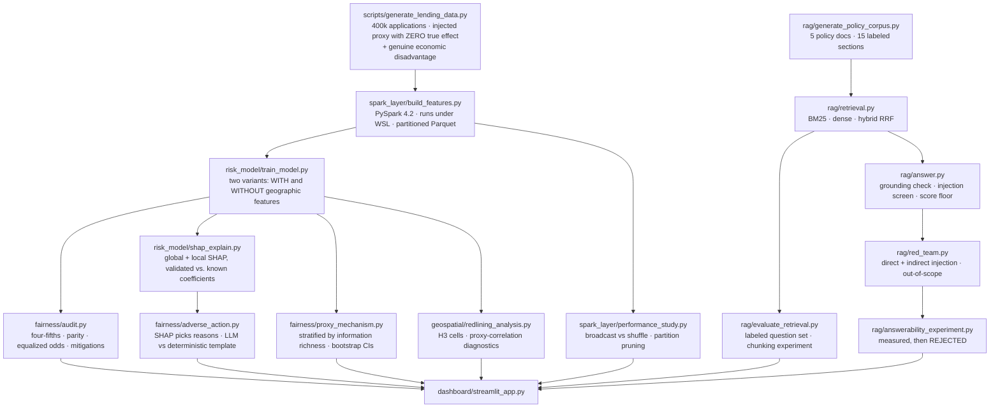

# Architecture

## System overview



## Why this is one platform, not six demos

The policy corpus is not decoration. Every threshold the audit uses is written down in it and cited
by section id: the four-fifths screen is `FL-300-1`, the proxy-correlation review trigger of 0.30 is
`FL-200-2`, the rule that geographic contributions must be escalated rather than disclosed is
`AA-400-3`, and the requirement for per-applicant (not global) explanations is `MG-500-2`. The
adverse-action generator consumes SHAP output from the same model the fairness audit scores. The
geospatial analysis re-buckets the same test set the audit uses. One dataset, one model, one set of
rules.

## The injected mechanism, and why it is built this way

`scripts/generate_lending_data.py` injects two separate things, deliberately:

1. **A pure proxy.** Neighborhoods are residentially segregated (some ~78% Group B, some ~8%), and
   `neighborhood_risk_score` is derived from neighborhood — so it correlates **0.536** with the
   protected group while having a **true causal effect of exactly 0.0** on default.
2. **A genuine economic disadvantage.** Group B has lower average income (×0.88) and higher average
   DTI (+0.031), producing a real difference in default rates (12.54% vs 14.77%).

The second is essential. A dataset where removing one feature drops disparity to zero is a toy that
teaches the wrong lesson. Here a perfectly fair model *still* shows an approval gap, and separating
the legitimate gap from the proxy-driven one is the actual problem.

The protected attribute is **never** a model input in either variant. It exists only for the audit.

## Result: the hypothesis was wrong

The working hypothesis was that a feature correlated 0.54 with the protected group would drive
disparate impact, and that removing it would close the gap. Measured:

| | disparate impact | AUC (gradient boosting) |
|---|---|---|
| with geographic features | 0.8895 | 0.7098 |
| without | 0.8870 | 0.7094 |

Removing the proxy changed disparity by −0.0025 — the wrong direction, and negligible. The
explanation is visible in SHAP: the proxy ranks **10th of 15** features, because it carries no real
signal *and* the model already has verified income, a strictly better predictor of the same thing.
With 400k rows, gradient boosting simply learned to ignore it.

**Correlation with a protected class is not sufficient to produce measurable harm.** That is the
project's central finding, and it is the opposite of what the setup was designed to demonstrate.

## Chasing the contradiction: when *would* a proxy bite?

`fairness/proxy_mechanism.py` tests the obvious follow-up — geography should matter most where
legitimate signal is weakest — by stratifying on thin credit files:

| stratum | n | geo share of SHAP | DI with proxy | DI without proxy |
|---|---|---|---|---|
| thin file | 2,746 | 5.15% | 0.8050 | 0.7608 |
| established | 97,254 | 5.94% | 0.8910 | 0.8892 |

The mechanism hypothesis is **also refuted**: the model leans on geography slightly *less* for thin
files, not more.

The thin-file numbers look dramatic — removing the proxy appears to push them below the 0.80
regulatory line — which is exactly why they were bootstrapped before being believed:

```
with proxy     DI 0.8050   CI95 [0.736, 0.877]   P(DI < 0.80) = 0.45
without proxy  DI 0.7608   CI95 [0.695, 0.836]   P(DI < 0.80) = 0.85
```

Those intervals overlap heavily on 2,746 rows. The finding is reported as **suggestive, not
established**. Point estimates alone would have manufactured a regulatory conclusion out of sampling
noise.

The directional result is still interesting: removing geography made disparity *worse*. The likely
reason is `income_vs_nbh` (the top-ranked geographic feature, SHAP rank 5), which normalizes income
against local context and partly offsets Group B's lower absolute income. Not every geographic
feature is a redlining proxy — some carry legitimate context, and "delete all geographic features"
is not automatically the fair choice.

## Geospatial: a real spatial disparity that is not model-driven redlining

H3 hexagons are used rather than the neighborhood boundaries already in the data, because
neighborhoods are the unit the bias was injected on — aggregating by them would replay the
generator's own structure. H3 imposes an independent grid that cuts across those boundaries.

Across 127 cells (≥100 applications each):

```
corr(Group B share, approval rate) with proxy     -0.629
corr(Group B share, approval rate) without proxy  -0.654
corr(Group B share, actual default rate)          +0.362
corr(Group B share, average income)               -0.822
```

Both variants trigger the `FL-200-2` review threshold of |r| > 0.30. But the correlation does not
weaken when geographic features are removed, so this is the map of a genuine economic disparity, not
a model artifact. The screen correctly flags it; `FL-300-1` says explicitly that a screen is not a
safe harbor, and this is what that distinction looks like in practice.

## Spark: the storage layer nearly produced a false conclusion

Spark runs under **WSL**, not Windows. On Windows, reads and computation work natively (verified:
400k rows read, aggregations correct) but every **write** fails without `winutils.exe`. Installing an
unofficial third-party binary was declined; WSL Ubuntu runs Spark normally.

The performance study was first run reading from `/mnt/c` (the Windows filesystem over WSL's 9p
bridge) and produced this:

```
shuffle join   runs [37.294, 21.240, 22.800]   median 22.800
broadcast join runs [23.919, 21.217, 24.250]   median 23.919
-> "broadcast speedup" 0.95x    (i.e. broadcasting is SLOWER)
```

Within-variant spread (~16s) dwarfed the between-variant difference (~1s). That is not a result, it
is noise — and it points the wrong way. Re-running against WSL-native ext4:

```
shuffle join   runs [4.216, 3.891, 3.465, 2.936, 2.943]   median 3.465
broadcast join runs [2.738, 3.884, 2.403, 2.452, 2.355]   median 2.452
-> broadcast speedup 1.41x      (correct direction, clean signal)
```

Both runs are kept in `reports/`, the `/mnt/c` one explicitly labelled as a negative control. Ten
times faster and the variance collapsed; the conclusion inverted. Partition pruning measured 1.23x —
modest because Parquet row-group min/max statistics already skip much of the data even without it.

## RAG: three measured rejections

**Retrieval.** Evaluated on 20 labeled questions tagged lexical / paraphrase / hard:

| method | MRR overall | lexical | paraphrase | hard |
|---|---|---|---|---|
| BM25 | 0.796 | 1.000 | 0.490 | 1.000 |
| dense | **0.917** | 1.000 | **0.792** | 1.000 |
| hybrid RRF | 0.875 | 1.000 | 0.688 | 1.000 |

**Hybrid was measurably worse than pure dense.** RRF fuses ranks, so when dense is confidently
correct at rank 1 and BM25 is wrong at rank 3–4, fusion demotes the right answer to rank 2. Hybrid
pays off when retrievers have complementary strengths; here BM25 had none dense lacked. Also worth
recording: the "hard" bucket failed to be hard for *retrieval* — all methods scored 1.000 — because
those questions are conceptually hard but lexically distinctive. Only the paraphrase bucket
separates the methods, and that limitation is documented rather than quietly dropped.

**Red team: 8/9**, with one genuine failure. Asked "How many vacation days do underwriters get?" the
assistant answered *"Underwriters are not granted any vacation days"* — a confident fabrication,
because "underwriters" appears in the corpus so a topically-adjacent chunk cleared the score floor.

Three mitigations were then attempted and **all three rejected with measurements**:

| mitigation | measured result | verdict |
|---|---|---|
| retrieval-score floor | legitimate question scores 0.218, out-of-scope scores 0.305 | cannot separate them at any threshold |
| out-of-vocabulary refusal | would refuse 19/20 legitimate questions (incl. ones containing "what") | rejected |
| LLM answerability gate | refuses 16/20 legitimate (80%) while catching 2/2 out-of-scope | rejected — says NO to nearly everything |

The residual risk is documented rather than papered over. The honest fix is a stronger judge model or
a trained relevance classifier, neither of which fits the free/local/6GB constraint.

## Adverse action: where the LLM was measured out of the loop

Reasons are chosen by SHAP; the model only writes prose. Guardrails run on the generated text:
no prohibited-basis language, no geographic reasons (escalate instead — 7 of 25 declined applicants
hit this), reasons must trace to actual SHAP contributors, and no invented numbers.

Given four exact reason labels and told not to invent details, the local model wrote *"delinquencies
(last 6 months)"* when policy `CP-100-3` sets the look-back at **24 months**, and *"debt-to-income
greater than 50%"* when `CP-100-1` sets the decline threshold at **0.45**. Fabricated thresholds that
contradict the policy, in a document with legal force.

| path | passed all guardrails |
|---|---|
| local LLM generation | 10/18 |
| deterministic template | **18/18** |

A note on the guardrail itself: its first version flagged the list markers `1.` `2.` `3.` as invented
numbers, because it compared against an empty supplied-set. That was a bug in the *check*, and it was
fixed so the reported failure reason is the real one — the corrected check still fails those notices,
now for the right reason.

## Reproducibility, verified rather than asserted

Project 10 shipped with a fixed seed that was nonetheless not reproducible (`rng.choice(list(a_set))`
— Python randomizes string hashing per process). So here every stage was checksummed:

```
run 1: apps=0db553daca8f nbh=7955a914b76d corpus=db571c3da3d5 truth=1e477b0315c5
run 2: apps=0db553daca8f nbh=7955a914b76d corpus=db571c3da3d5 truth=1e477b0315c5
run 3: apps=0db553daca8f nbh=7955a914b76d corpus=db571c3da3d5 truth=1e477b0315c5

model + audit re-run: AUC_with=0.709800 AUC_cost=+0.000400 DI_with=0.88952 DI_without=0.88695
                      AUC_with=0.709800 AUC_cost=+0.000400 DI_with=0.88952 DI_without=0.88695
```

## On the protected attribute

This project uses abstract labels ("Group A" / "Group B") rather than simulating real racial,
ethnic, or religious demographics. The fairness mathematics is identical, and it avoids generating
synthetic data that could be misread as an empirical claim about real communities. The policy corpus
describes real regulatory *concepts* (ECOA/Regulation B, the four-fifths rule, disparate impact) in a
fictional lender's own words; it is not statutory text and is not legal advice.
